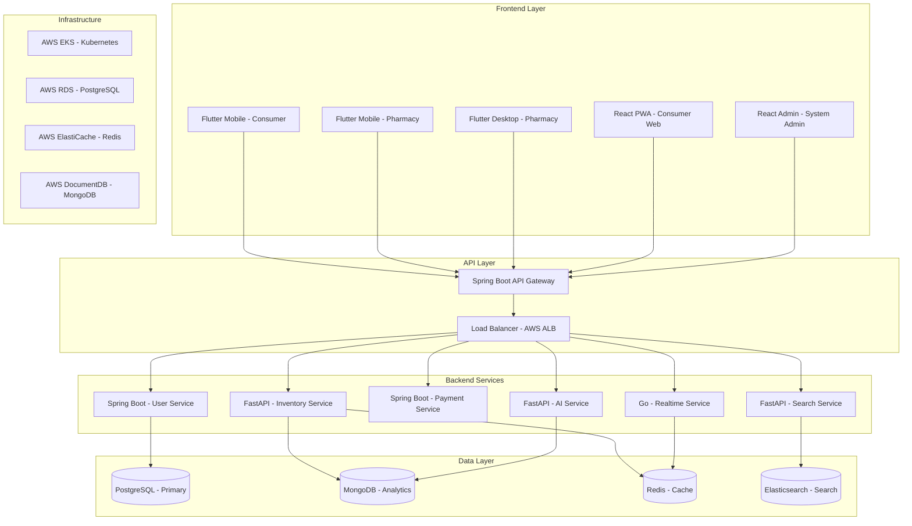

# MediFind Ghana - Final Production Tech Stack 2024

## 🎯 **Complete Architecture Overview**


<details>
<summary>Mermaid prompt</summary>          
https://mermaid.live/edit#pako:eNqFlG9vojAcgL9K01cu0UXijMCLS0DUMXFD2bLk8F5U6JQMWlPKdtyy734_im696WW84qFPf_8KvOGEpxTbeCvIfofu3TVDcJXVpn2wxlPBmaQsRQGpqVjjVmguJ57mlZRUoAXfZDlFPTTmrKwKKn59Wu6pFe6IKEhSa9b4w_Jo-Sz5_rzmxStKEonCR0fLhh7pRpMmB8lJi4yBFtWlpEWLBw36aW9O2nVC_7TTaRztRca2yOUc4oIyI5K-Er20WRxwkiKX5IQlUFMPOY8RcgL325QuSZ6bAUdUvGQJLfXM1_9k7qGHEkIfRC25H09JKZvCeshnL5RJLuoz3s2XcCGpC5DPmHMtYkSJSHZnpCCecViHcecyK-gZY6GFcfwvwv9H4hFJTo_hNu6EvJRbQaNl0FQvsoKI-kLLdxd3Fpxtuec2CRnJa5klpW6EcWdF06xs3h-S7Ki-tow7kxzqhS1ty8feL76t2GdPAnaKKpGVoHrVq7h5ESbzCKLNqw0VjEpaalkjJay8RvjsTxPu2wiqMlWzmjn0oDkPyvF4UjUHqto_DOJ86fD99H6gaQuuDmMdPB0mOkwVzFqYKbjWwdfhRoe5DoEOixauFdy24Cu40yFsYa5g2UKgryyOe3AXw_-hIFkKv7i3ZnGN5Y4WcEA23KZEPDdH9Q4eqSSPapZgGw6RdrHg1XaH7SeSl0DVPoUv3ssInHdxVPaE_eT8A7eiSXPYDeOmYswrJrFtjAwlY_sN_8a2aVz2R4Y1svqmMTRMc9DFNbatS-vKtIyr_mg4GA4Mw3zv4j8qev_SbFZGA6tvWUO4Gb3_BTfmn8k



</details>

---

## 📱 **Frontend Stack**

### **Mobile Applications (Flutter 3.16+)**

#### **Consumer Mobile App**
```dart
// pubspec.yaml
name: medifind_consumer
description: Find medications across Ghana pharmacies

environment:
  sdk: '>=3.1.0 <4.0.0'
  flutter: ">=3.16.0"

dependencies:
  flutter:
    sdk: flutter
  
  # State Management
  riverpod: ^2.4.0
  flutter_riverpod: ^2.4.0
  riverpod_annotation: ^2.2.0
  
  # Navigation
  go_router: ^12.1.1
  
  # Networking & Data
  dio: ^5.3.2
  retrofit: ^4.0.3
  json_annotation: ^4.8.1
  freezed: ^2.4.6
  
  # Local Storage
  hive: ^2.2.3
  hive_flutter: ^1.1.0
  shared_preferences: ^2.2.2
  
  # UI Components
  flutter_screenutil: ^5.9.0
  flutter_svg: ^2.0.9
  cached_network_image: ^3.3.0
  
  # Location & Maps
  geolocator: ^10.1.0
  google_maps_flutter: ^2.5.0
  geocoding: ^2.1.1
  
  # Device Features
  camera: ^0.10.5+5
  image_picker: ^1.0.4
  url_launcher: ^6.2.1
  permission_handler: ^11.0.1
  
  # Offline & Sync
  connectivity_plus: ^5.0.1
  sqflite: ^2.3.0
  
  # Ghana-Specific
  intl: ^0.18.1  # Localization support
  
dev_dependencies:
  flutter_test:
    sdk: flutter
  build_runner: ^2.4.7
  retrofit_generator: ^8.0.4
  json_serializable: ^6.7.1
  riverpod_generator: ^2.3.0
  freezed_annotation: ^2.4.1
  hive_generator: ^2.0.1
  flutter_lints: ^3.0.1
```

#### **Pharmacy Mobile/Desktop App**
```dart
// Additional dependencies for pharmacy features
dependencies:
  # CSV/Excel handling
  csv: ^5.0.2
  excel: ^2.1.0
  
  # File operations
  file_picker: ^6.1.1
  path_provider: ^2.1.1
  
  # Printing & QR codes
  printing: ^5.11.1
  qr_flutter: ^4.1.0
  qr_code_scanner: ^1.0.1
  
  # Desktop-specific
  window_manager: ^0.3.7
  system_tray: ^2.0.3
  hotkey_manager: ^0.1.8
  
  # Bluetooth for POS integration
  flutter_bluetooth_serial: ^0.4.0
  
  # Advanced charts
  fl_chart: ^0.65.0
  syncfusion_flutter_charts: ^23.2.7
```

### **Web Applications**

#### **Consumer PWA (Next.js 14 + TypeScript)**
```json
{
  "dependencies": {
    "next": "14.0.3",
    "react": "^18.2.0",
    "react-dom": "^18.2.0",
    "typescript": "^5.3.2",
    
    "next-pwa": "^5.6.0",
    "workbox": "^7.0.0",
    
    "@tanstack/react-query": "^5.8.4",
    "axios": "^1.6.2",
    "swr": "^2.2.4",
    
    "tailwindcss": "^3.3.6",
    "headlessui": "^1.7.17",
    "heroicons": "^2.0.18",
    
    "@googlemaps/react-wrapper": "^1.1.35",
    "leaflet": "^1.9.4",
    "react-leaflet": "^4.2.1",
    
    "zustand": "^4.4.7",
    "react-hook-form": "^7.48.2",
    "zod": "^3.22.4",
    
    "framer-motion": "^10.16.16"
  },
  "devDependencies": {
    "@types/node": "^20.10.0",
    "@types/react": "^18.2.42",
    "@types/react-dom": "^18.2.17",
    "eslint": "^8.55.0",
    "eslint-config-next": "14.0.3",
    "prettier": "^3.1.0",
    "autoprefixer": "^10.4.16",
    "postcss": "^8.4.32"
  }
}
```

#### **Admin Dashboard (React + TypeScript)**
```json
{
  "dependencies": {
    "react": "^18.2.0",
    "react-dom": "^18.2.0",
    "typescript": "^5.3.2",
    
    "@tanstack/react-query": "^5.8.4",
    "axios": "^1.6.2",
    
    "antd": "^5.12.8",
    "@ant-design/icons": "^5.2.6",
    "@ant-design/pro-components": "^2.6.43",
    
    "react-router-dom": "^6.20.1",
    "react-helmet-async": "^2.0.4",
    
    "recharts": "^2.8.0",
    "apexcharts": "^3.44.0",
    "react-apexcharts": "^1.4.1",
    
    "react-table": "^7.8.0",
    "@tanstack/react-table": "^8.10.7",
    
    "socket.io-client": "^4.7.4",
    "dayjs": "^1.11.10",
    
    "react-json-view": "^1.21.3",
    "@monaco-editor/react": "^4.6.0"
  }
}
```

---

## ⚙️ **Backend Architecture**

### **API Gateway (Spring Boot 3.2)**

```xml
<!-- pom.xml -->
<dependencies>
    <!-- Spring Boot Starters -->
    <dependency>
        <groupId>org.springframework.boot</groupId>
        <artifactId>spring-boot-starter-webflux</artifactId>
    </dependency>
    <dependency>
        <groupId>org.springframework.cloud</groupId>
        <artifactId>spring-cloud-starter-gateway</artifactId>
    </dependency>
    <dependency>
        <groupId>org.springframework.cloud</groupId>
        <artifactId>spring-cloud-starter-netflix-eureka-client</artifactId>
    </dependency>
    
    <!-- Security & JWT -->
    <dependency>
        <groupId>org.springframework.boot</groupId>
        <artifactId>spring-boot-starter-security</artifactId>
    </dependency>
    <dependency>
        <groupId>org.springframework.security</groupId>
        <artifactId>spring-security-oauth2-resource-server</artifactId>
    </dependency>
    <dependency>
        <groupId>org.springframework.security</groupId>
        <artifactId>spring-security-oauth2-jose</artifactId>
    </dependency>
    
    <!-- Rate Limiting & Circuit Breaker -->
    <dependency>
        <groupId>org.springframework.cloud</groupId>
        <artifactId>spring-cloud-starter-circuitbreaker-reactor-resilience4j</artifactId>
    </dependency>
    <dependency>
        <groupId>org.springframework.boot</groupId>
        <artifactId>spring-boot-starter-data-redis-reactive</artifactId>
    </dependency>
    
    <!-- Monitoring & Observability -->
    <dependency>
        <groupId>org.springframework.boot</groupId>
        <artifactId>spring-boot-starter-actuator</artifactId>
    </dependency>
    <dependency>
        <groupId>io.micrometer</groupId>
        <artifactId>micrometer-registry-prometheus</artifactId>
    </dependency>
    <dependency>
        <groupId>io.micrometer</groupId>
        <artifactId>micrometer-tracing-bridge-otel</artifactId>
    </dependency>
</dependencies>
```

### **User Service (Spring Boot 3.2)**

```xml
<dependencies>
    <!-- Spring Boot Web -->
    <dependency>
        <groupId>org.springframework.boot</groupId>
        <artifactId>spring-boot-starter-web</artifactId>
    </dependency>
    <dependency>
        <groupId>org.springframework.boot</groupId>
        <artifactId>spring-boot-starter-data-jpa</artifactId>
    </dependency>
    <dependency>
        <groupId>org.springframework.boot</groupId>
        <artifactId>spring-boot-starter-validation</artifactId>
    </dependency>
    
    <!-- Database -->
    <dependency>
        <groupId>org.postgresql</groupId>
        <artifactId>postgresql</artifactId>
    </dependency>
    <dependency>
        <groupId>org.flywaydb</groupId>
        <artifactId>flyway-core</artifactId>
    </dependency>
    
    <!-- Security -->
    <dependency>
        <groupId>org.springframework.boot</groupId>
        <artifactId>spring-boot-starter-security</artifactId>
    </dependency>
    <dependency>
        <groupId>com.auth0</groupId>
        <artifactId>java-jwt</artifactId>
    </dependency>
    
    <!-- Redis for caching -->
    <dependency>
        <groupId>org.springframework.boot</groupId>
        <artifactId>spring-boot-starter-data-redis</artifactId>
    </dependency>
    
    <!-- SMS & Communication -->
    <dependency>
        <groupId>com.twilio.sdk</groupId>
        <artifactId>twilio</artifactId>
        <version>9.14.1</version>
    </dependency>
    
    <!-- Ghana Mobile Money APIs -->
    <dependency>
        <groupId>org.springframework.boot</groupId>
        <artifactId>spring-boot-starter-webflux</artifactId>
    </dependency>
    
    <!-- Testing -->
    <dependency>
        <groupId>org.springframework.boot</groupId>
        <artifactId>spring-boot-starter-test</artifactId>
        <scope>test</scope>
    </dependency>
    <dependency>
        <groupId>org.testcontainers</groupId>
        <artifactId>postgresql</artifactId>
        <scope>test</scope>
    </dependency>
</dependencies>
```

### **Inventory Service (FastAPI + Python 3.11)**

```python
# requirements.txt
fastapi==0.104.1
uvicorn[standard]==0.24.0
gunicorn==21.2.0

# Database & ORM
sqlalchemy==2.0.23
alembic==1.13.1
asyncpg==0.29.0
psycopg2-binary==2.9.9

# MongoDB
motor==3.3.2
pymongo==4.6.0

# Redis
redis==5.0.1
aioredis==2.0.1

# HTTP & API
httpx==0.25.2
aiohttp==3.9.1
requests==2.31.0

# Data Processing
pandas==2.1.4
numpy==1.25.2
openpyxl==3.1.2
python-multipart==0.0.6

# ML & AI
scikit-learn==1.3.2
sentence-transformers==2.2.2
transformers==4.36.2
torch==2.1.1
faiss-cpu==1.7.4

# Time Series & Analytics
prophet==1.1.5
plotly==5.17.0

# Background Jobs
celery==5.3.4
celery[redis]==5.3.4

# Validation & Serialization
pydantic==2.5.2
pydantic-settings==2.1.0

# Authentication
python-jose[cryptography]==3.3.0
passlib[bcrypt]==1.7.4

# Monitoring
prometheus-client==0.19.0
structlog==23.2.0

# Ghana-specific
phonenumbers==8.13.26
python-dateutil==2.8.2
pytz==2023.3

# Development
pytest==7.4.3
pytest-asyncio==0.21.1
black==23.11.0
isort==5.12.0
mypy==1.7.1
```

### **Search Service (FastAPI + Elasticsearch)**

```python
# Additional requirements for search service
elasticsearch==8.11.1
elasticsearch-dsl==8.11.0

# NLP & Text Processing
spacy==3.7.2
nltk==3.8.1

# Ghana Language Processing
googletrans==3.1.0-alpha

# Vector Search
chromadb==0.4.18
pinecone-client==2.2.4

# Advanced ML
xgboost==2.0.2
lightgbm==4.1.0
```

### **Real-time Service (Go 1.21)**

```go
// go.mod
module medifind-realtime

go 1.21

require (
    github.com/gorilla/websocket v1.5.1
    github.com/redis/go-redis/v9 v9.3.0
    github.com/segmentio/kafka-go v0.4.47
    
    // HTTP & API
    github.com/gin-gonic/gin v1.9.1
    github.com/go-chi/chi/v5 v5.0.10
    
    // Database
    github.com/jackc/pgx/v5 v5.5.0
    github.com/jmoiron/sqlx v1.3.5
    
    // Configuration
    github.com/spf13/viper v1.17.0
    github.com/joho/godotenv v1.4.0
    
    // Logging & Monitoring
    github.com/sirupsen/logrus v1.9.3
    github.com/prometheus/client_golang v1.17.0
    
    // Utils
    github.com/google/uuid v1.5.0
    github.com/golang-jwt/jwt/v5 v5.2.0
)
```

### **Payment Service (Spring Boot)**

```xml
<!-- Additional dependencies for Ghana payments -->
<dependencies>
    <!-- Mobile Money APIs -->
    <dependency>
        <groupId>org.springframework.boot</groupId>
        <artifactId>spring-boot-starter-webflux</artifactId>
    </dependency>
    
    <!-- Cryptography for payment security -->
    <dependency>
        <groupId>org.bouncycastle</groupId>
        <artifactId>bcprov-jdk15on</artifactId>
        <version>1.70</version>
    </dependency>
    
    <!-- JSON Processing -->
    <dependency>
        <groupId>com.fasterxml.jackson.core</groupId>
        <artifactId>jackson-core</artifactId>
    </dependency>
    
    <!-- HTTP Client for external APIs -->
    <dependency>
        <groupId>org.apache.httpcomponents.client5</groupId>
        <artifactId>httpclient5</artifactId>
    </dependency>
    
    <!-- State Machine for payment flows -->
    <dependency>
        <groupId>org.springframework.statemachine</groupId>
        <artifactId>spring-statemachine-core</artifactId>
    </dependency>
</dependencies>
```

---

## 🗄️ **Database Layer**

### **PostgreSQL 15 (Primary Database)**

```sql
-- Core schema with Ghana-specific optimizations

-- Users table with Ghana-specific fields
CREATE TABLE users (
    id UUID PRIMARY KEY DEFAULT gen_random_uuid(),
    phone VARCHAR(15) UNIQUE NOT NULL, -- Ghana phone format
    email VARCHAR(255) UNIQUE,
    name VARCHAR(255) NOT NULL,
    nhis_number VARCHAR(20), -- Ghana NHIS number
    location POINT, -- PostGIS for GPS coordinates
    language user_language DEFAULT 'english',
    preferred_currency VARCHAR(3) DEFAULT 'GHS',
    created_at TIMESTAMP WITH TIME ZONE DEFAULT NOW(),
    updated_at TIMESTAMP WITH TIME ZONE DEFAULT NOW(),
    is_active BOOLEAN DEFAULT TRUE,
    last_login TIMESTAMP WITH TIME ZONE,
    failed_login_attempts INTEGER DEFAULT 0,
    account_locked_until TIMESTAMP WITH TIME ZONE
);

-- Pharmacies with comprehensive Ghana data
CREATE TABLE pharmacies (
    id UUID PRIMARY KEY DEFAULT gen_random_uuid(),
    name VARCHAR(255) NOT NULL,
    address TEXT NOT NULL,
    location POINT NOT NULL, -- PostGIS for spatial queries
    phone VARCHAR(15),
    email VARCHAR(255),
    license_number VARCHAR(50) UNIQUE,
    nepp_verified BOOLEAN DEFAULT FALSE,
    nepp_registration_date DATE,
    operating_hours JSONB, -- Flexible schedule storage
    services TEXT[], -- Array of services offered
    delivery_available BOOLEAN DEFAULT FALSE,
    delivery_radius_km DECIMAL(5,2),
    accepts_nhis BOOLEAN DEFAULT FALSE,
    payment_methods TEXT[], -- Mobile Money, cards, etc.
    owner_id UUID REFERENCES users(id),
    chain_id UUID, -- For pharmacy chains
    created_at TIMESTAMP WITH TIME ZONE DEFAULT NOW(),
    updated_at TIMESTAMP WITH TIME ZONE DEFAULT NOW(),
    is_active BOOLEAN DEFAULT TRUE
);

-- Medications master data
CREATE TABLE medications (
    id UUID PRIMARY KEY DEFAULT gen_random_uuid(),
    name VARCHAR(255) NOT NULL,
    generic_name VARCHAR(255),
    brand_names TEXT[], -- Array of brand names
    dosage_form dosage_form_enum NOT NULL,
    strength VARCHAR(100),
    manufacturer VARCHAR(255),
    fda_ghana_approval VARCHAR(100),
    who_essential_medicine BOOLEAN DEFAULT FALSE,
    controlled_substance BOOLEAN DEFAULT FALSE,
    requires_prescription BOOLEAN DEFAULT TRUE,
    therapeutic_category VARCHAR(255),
    atc_code VARCHAR(10), -- WHO ATC classification
    common_uses TEXT[],
    side_effects TEXT[],
    contraindications TEXT[],
    storage_requirements TEXT,
    created_at TIMESTAMP WITH TIME ZONE DEFAULT NOW(),
    updated_at TIMESTAMP WITH TIME ZONE DEFAULT NOW()
);

-- Performance indexes
CREATE INDEX CONCURRENTLY idx_users_phone ON users(phone);
CREATE INDEX CONCURRENTLY idx_users_location ON users USING GIST(location);
CREATE INDEX CONCURRENTLY idx_pharmacies_location ON pharmacies USING GIST(location);
CREATE INDEX CONCURRENTLY idx_pharmacies_nepp_verified ON pharmacies(nepp_verified) WHERE nepp_verified = TRUE;
CREATE INDEX CONCURRENTLY idx_medications_name_gin ON medications USING GIN(to_tsvector('english', name));
CREATE INDEX CONCURRENTLY idx_medications_generic_name ON medications(generic_name);

-- Partitioning for high-volume tables
CREATE TABLE user_searches (
    id BIGSERIAL,
    user_id UUID NOT NULL REFERENCES users(id),
    search_term TEXT NOT NULL,
    location POINT,
    results_count INTEGER,
    clicked_result_id UUID,
    search_duration_ms INTEGER,
    created_at TIMESTAMP WITH TIME ZONE DEFAULT NOW()
) PARTITION BY RANGE (created_at);

-- Create monthly partitions
CREATE TABLE user_searches_2024_12 PARTITION OF user_searches
FOR VALUES FROM ('2024-12-01') TO ('2025-01-01');
```

### **MongoDB (Analytics & High-Frequency Data)**

```javascript
// Database: medifind_analytics

// Inventory collection with real-time updates
db.createCollection("inventory_realtime", {
    validator: {
        $jsonSchema: {
            bsonType: "object",
            required: ["pharmacy_id", "medication_id", "price", "last_updated"],
            properties: {
                pharmacy_id: { bsonType: "string" },
                medication_id: { bsonType: "string" },
                quantity: { bsonType: "int", minimum: 0 },
                price: { bsonType: "decimal" },
                currency: { bsonType: "string", enum: ["GHS", "USD"] },
                batch_number: { bsonType: "string" },
                expiry_date: { bsonType: "date" },
                supplier: { bsonType: "string" },
                last_updated: { bsonType: "date" },
                reserved_quantity: { bsonType: "int", minimum: 0 },
                reorder_level: { bsonType: "int" },
                reorder_quantity: { bsonType: "int" }
            }
        }
    }
});

// Optimized indexes for Ghana use cases
db.inventory_realtime.createIndex({ 
    "pharmacy_id": 1, 
    "medication_id": 1 
}, { unique: true });

db.inventory_realtime.createIndex({ 
    "medication_id": 1, 
    "price": 1, 
    "quantity": -1 
});

db.inventory_realtime.createIndex({ 
    "last_updated": -1 
});

// Search analytics collection
db.createCollection("search_analytics", {
    timeseries: {
        timeField: "timestamp",
        metaField: "metadata",
        granularity: "minutes"
    }
});

db.search_analytics.createIndex({ 
    "timestamp": 1, 
    "metadata.user_id": 1 
});

// Price history for trend analysis
db.createCollection("price_history", {
    timeseries: {
        timeField: "timestamp",
        metaField: "metadata",
        granularity: "hours"
    }
});

// Ghana-specific collections
db.createCollection("ghana_health_data", {
    validator: {
        $jsonSchema: {
            properties: {
                region: { bsonType: "string", enum: ["Greater Accra", "Ashanti", "Western", "Northern", "Eastern", "Central", "Volta", "Upper East", "Upper West", "Brong-Ahafo"] },
                disease_outbreaks: { bsonType: "array" },
                seasonal_patterns: { bsonType: "object" }
            }
        }
    }
});
```

### **Redis 7 (Caching & Session Store)**

```redis
# Cache configuration for Ghana-specific data

# Search result caching (1-5 minutes TTL)
SET "search:paracetamol:accra:5km" "json_search_results" EX 300

# Pharmacy availability cache (30 seconds TTL)
SET "pharmacy:availability:12345" "json_availability_data" EX 30

# User session management
SET "session:user:abc123" "jwt_token_data" EX 3600

# Mobile Money transaction tracking
SET "payment:mtn:txn456" "payment_status" EX 1800

# Rate limiting per user
INCR "rate_limit:user:abc123:search"
EXPIRE "rate_limit:user:abc123:search" 3600

# Ghana regional data cache
SET "ghana:pharmacies:accra" "pharmacy_list_json" EX 86400
SET "ghana:medications:essential" "essential_meds_json" EX 604800

# Real-time inventory updates
ZADD "inventory_updates" 1701234567 "pharmacy:123:med:456"

# Popular searches cache
ZADD "popular_searches:daily" 100 "paracetamol"
ZADD "popular_searches:daily" 85 "amoxicillin"
```

### **Elasticsearch 8 (Search Engine)**

```json
{
  "mappings": {
    "properties": {
      "medication_name": {
        "type": "text",
        "analyzer": "ghana_medication_analyzer",
        "search_analyzer": "ghana_search_analyzer",
        "fields": {
          "keyword": { "type": "keyword" },
          "ngram": { "type": "text", "analyzer": "ngram_analyzer" }
        }
      },
      "generic_name": {
        "type": "text",
        "analyzer": "standard",
        "fields": { "keyword": { "type": "keyword" } }
      },
      "brand_names": {
        "type": "text",
        "analyzer": "ghana_brand_analyzer"
      },
      "therapeutic_category": { "type": "keyword" },
      "pharmacy_location": { "type": "geo_point" },
      "price": { "type": "scaled_float", "scaling_factor": 100 },
      "availability": { "type": "boolean" },
      "pharmacy_rating": { "type": "float" },
      "last_updated": { "type": "date" }
    }
  },
  "settings": {
    "analysis": {
      "analyzer": {
        "ghana_medication_analyzer": {
          "type": "custom",
          "tokenizer": "standard",
          "filter": ["lowercase", "ghana_medication_synonyms", "stemmer"]
        },
        "ghana_brand_analyzer": {
          "type": "custom",
          "tokenizer": "keyword",
          "filter": ["lowercase", "ghana_brand_synonyms"]
        }
      },
      "filter": {
        "ghana_medication_synonyms": {
          "type": "synonym",
          "synonyms": [
            "panadol,paracetamol,acetaminophen",
            "brufen,ibuprofen",
            "flagyl,metronidazole",
            "amalar,coartem,artemether"
          ]
        }
      }
    }
  }
}
```

---

## ☁️ **Infrastructure & Deployment**

### **AWS Architecture**

```yaml
# Kubernetes cluster configuration (EKS)
apiVersion: v1
kind: ConfigMap
metadata:
  name: medifind-config
data:
  # Database connections
  POSTGRES_HOST: "medifind-postgres.cluster-xyz.eu-west-1.rds.amazonaws.com"
  MONGODB_HOST: "medifind-docdb.cluster-xyz.eu-west-1.docdb.amazonaws.com"
  REDIS_HOST: "medifind-redis.xyz.cache.amazonaws.com"
  ELASTICSEARCH_HOST: "https://medifind-es.es.eu-west-1.amazonaws.com"
  
  # Ghana-specific configurations
  DEFAULT_TIMEZONE: "Africa/Accra"
  DEFAULT_CURRENCY: "GHS"
  DEFAULT_COUNTRY: "GH"
  
  # External services
  TWILIO_SMS_SERVICE: "enabled"
  MTN_MOBILE_MONEY_API: "enabled"
  VODAFONE_CASH_API: "enabled"
  
  # Feature flags
  AI_ASSISTANT_ENABLED: "true"
  REAL_TIME_INVENTORY: "true"
  OFFLINE_MODE_SUPPORTED: "true"

---
# Spring Boot API Gateway deployment
apiVersion: apps/v1
kind: Deployment
metadata:
  name: api-gateway
spec:
  replicas: 3
  selector:
    matchLabels:
      app: api-gateway
  template:
    spec:
      containers:
      - name: api-gateway
        image: medifind/api-gateway:1.0.0
        ports:
        - containerPort: 8080
        env:
        - name: SPRING_PROFILES_ACTIVE
          value: "production"
        resources:
          requests:
            memory: "512Mi"
            cpu: "500m"
          limits:
            memory: "1Gi"
            cpu: "1000m"

---
# FastAPI Inventory Service
apiVersion: apps/v1
kind: Deployment
metadata:
  name: inventory-service
spec:
  replicas: 5  # High availability for critical service
  selector:
    matchLabels:
      app: inventory-service
  template:
    spec:
      containers:
      - name: inventory-service
        image: medifind/inventory-service:1.0.0
        ports:
        - containerPort: 8000
        env:
        - name: DATABASE_URL
          valueFrom:
            secretKeyRef:
              name: database-secrets
              key: mongodb-url
        resources:
          requests:
            memory: "256Mi"
            cpu: "250m"
          limits:
            memory: "512Mi"
            cpu: "500m"
```

### **Terraform Infrastructure**

```hcl
# main.tf
provider "aws" {
  region = "eu-west-1"  # Closest to Ghana
}

# VPC Configuration
module "vpc" {
  source = "terraform-aws-modules/vpc/aws"
  
  name = "medifind-vpc"
  cidr = "10.0.0.0/16"
  
  azs             = ["eu-west-1a", "eu-west-1b", "eu-west-1c"]
  private_subnets = ["10.0.1.0/24", "10.0.2.0/24", "10.0.3.0/24"]
  public_subnets  = ["10.0.101.0/24", "10.0.102.0/24", "10.0.103.0/24"]
  
  enable_nat_gateway = true
  enable_vpn_gateway = true
  enable_dns_hostnames = true
  enable_dns_support = true
}

# EKS Cluster
module "eks" {
  source = "terraform-aws-modules/eks/aws"
  
  cluster_name    = "medifind-production"
  cluster_version = "1.28"
  
  vpc_id     = module.vpc.vpc_id
  subnet_ids = module.vpc.private_subnets
  
  cluster_endpoint_private_access = true
  cluster_endpoint_public_access  = true
  
  node_groups = {
    main = {
      desired_capacity = 3
      max_capacity     = 10
      min_capacity     = 2
      
      instance_types = ["t3.medium", "t3.large"]
      
      k8s_labels = {
        Environment = "production"
        Application = "medifind"
      }
    }
    
    high_memory = {
      desired_capacity = 2
      max_capacity     = 5
      min_capacity     = 1
      
      instance_types = ["r5.large"]  # For ML/AI services
      
      k8s_labels = {
        NodeType = "ml-optimized"
      }
    }
  }
}

# RDS PostgreSQL
resource "aws_db_instance" "postgres" {
  identifier = "medifind-postgres"
  
  engine         = "postgres"
  engine_version = "15.4"
  instance_class = "db.r5.xlarge"
  
  allocated_storage     = 100
  max_allocated_storage = 1000
  storage_type         = "gp3"
  storage_encrypted    = true
  
  db_name  = "medifind"
  username = var.db_username
  password = var.db_password
  
  vpc_security_group_ids = [aws_security_group.rds.id]
  db_subnet_group_name   = aws_db_subnet_group.postgres.name
  
  backup_retention_period = 7
  backup_window          = "03:00-04:00"
  maintenance_window     = "sun:04:00-sun:05:00"
  
  skip_final_snapshot = false
  final_snapshot_identifier = "medifind-postgres-final-snapshot"
  
  performance_insights_enabled = true
  monitoring_interval         = 60
  
  tags = {
    Name = "MediFind PostgreSQL"
    Environment = "production"
  }
}

# DocumentDB (MongoDB-compatible)
resource "aws_docdb_cluster" "mongodb" {
  cluster_identifier      = "medifind-docdb"
  engine                 = "docdb"
  
  master_username        = var.docdb_username
  master_password        = var.docdb_password
  
  backup_retention_period = 5
  preferred_backup_window = "03:00-04:00"
  
  skip_final_snapshot = false
  final_snapshot_identifier = "medifind-docdb-final-snapshot"
  
  vpc_security_group_ids = [aws_security_group.docdb.id]
  db_subnet_group_name   = aws_docdb_subnet_group.mongodb.name
  
  storage_encrypted = true
  
  tags = {
    Name = "MediFind DocumentDB"
    Environment = "production"
  }
}

resource "aws_docdb_cluster_instance" "mongodb_instances" {
  count              = 2
  identifier         = "medifind-docdb-${count.index}"
  cluster_identifier = aws_docdb_cluster.mongodb.id
  instance_class     = "db.r5.large"
}

# ElastiCache Redis
resource "aws_elasticache_replication_group" "redis" {
  replication_group_id         = "medifind-redis"
  description                  = "MediFind Redis cluster"
  
  port                        = 6379
  parameter_group_name        = "default.redis7"
  engine_version              = "7.0"
  
  node_type                   = "cache.r5.large"
  num_cache_clusters          = 2
  
  subnet_group_name           = aws_elasticache_subnet_group.redis.name
  security_group_ids          = [aws_security_group.redis.id]
  
  at_rest_encryption_enabled  = true
  transit_encryption_enabled  = true
  
  automatic_failover_enabled  = true
  multi_az_enabled           = true
  
  snapshot_retention_limit    = 3
  snapshot_window            = "03:00-05:00"
  
  tags = {
    Name = "MediFind Redis"
    Environment = "production"
  }
}

# Elasticsearch
resource "aws_elasticsearch_domain" "search" {
  domain_name           = "medifind-search"
  elasticsearch_version = "8.9"
  
  cluster_config {
    instance_type            = "r5.large.elasticsearch"
    instance_count           = 3
    dedicated_master_enabled = true
    master_instance_type     = "r5.medium.elasticsearch"
    master_instance_count    = 3
    zone_awareness_enabled   = true
  }
  
  ebs_options {
    ebs_enabled = true
    volume_type = "gp3"
    volume_size = 100
  }
  
  vpc_options {
    security_group_ids = [aws_security_group.elasticsearch.id]
    subnet_ids         = slice(module.vpc.private_subnets, 0, 2)
  }
  
  encrypt_at_rest {
    enabled = true
  }
  
  node_to_node_encryption {
    enabled = true
  }
  
  domain_endpoint_options {
    enforce_https = true
  }
  
  advanced_security_options {
    enabled                        = true
    internal_user_database_enabled = false
    master_user_options {
      master_user_arn = aws_iam_role.elasticsearch_master.arn
    }
  }
  
  tags = {
    Name = "MediFind Elasticsearch"
    Environment = "production"
  }
}
```

---

## 🔄 **CI/CD Pipeline**

### **GitHub Actions Workflow**

```yaml
# .github/workflows/deploy-production.yml
name: Deploy to Production

on:
  push:
    branches: [main]
    tags: ['v*']
  pull_request:
    branches: [main]

env:
  AWS_REGION: eu-west-1
  EKS_CLUSTER_NAME: medifind-production

jobs:
  test:
    runs-on: ubuntu-latest
    
    services:
      postgres:
        image: postgres:15
        env:
          POSTGRES_PASSWORD: postgres
        options: >-
          --health-cmd pg_isready
          --health-interval 10s
          --health-timeout 5s
          --health-retries 5
      
      redis:
        image: redis:7
        options: >-
          --health-cmd "redis-cli ping"
          --health-interval 10s
          --health-timeout 5s
          --health-retries 5
      
      mongodb:
        image: mongo:7.0
        env:
          MONGO_INITDB_ROOT_USERNAME: admin
          MONGO_INITDB_ROOT_PASSWORD: password

    steps:
    - uses: actions/checkout@v4
    
    - name: Setup JDK 21
      uses: actions/setup-java@v3
      with:
        java-version: '21'
        distribution: 'temurin'
    
    - name: Setup Python 3.11
      uses: actions/setup-python@v4
      with:
        python-version: '3.11'
    
    - name: Setup Go 1.21
      uses: actions/setup-go@v4
      with:
        go-version: '1.21'
    
    - name: Setup Node.js 20
      uses: actions/setup-node@v4
      with:
        node-version: '20'
        cache: 'npm'
        cache-dependency-path: 'frontend/package-lock.json'
    
    - name: Cache Maven dependencies
      uses: actions/cache@v3
      with:
        path: ~/.m2
        key: ${{ runner.os }}-m2-${{ hashFiles('**/pom.xml') }}
    
    - name: Cache Python dependencies
      uses: actions/cache@v3
      with:
        path: ~/.cache/pip
        key: ${{ runner.os }}-pip-${{ hashFiles('**/requirements.txt') }}
    
    # Run tests for all services
    - name: Test Spring Boot Services
      run: |
        cd services/api-gateway && mvn test
        cd ../user-service && mvn test
        cd ../payment-service && mvn test
    
    - name: Test FastAPI Services
      run: |
        cd services/inventory-service
        pip install -r requirements.txt
        pytest tests/
        
        cd ../search-service  
        pip install -r requirements.txt
        pytest tests/
        
        cd ../ai-service
        pip install -r requirements.txt
        pytest tests/
    
    - name: Test Go Services
      run: |
        cd services/realtime-service
        go test ./...
    
    - name: Test Frontend Applications
      run: |
        cd frontend/consumer-pwa
        npm ci
        npm run test
        npm run build
        
        cd ../admin-dashboard
        npm ci
        npm run test
        npm run build
    
    - name: Test Flutter Applications
      uses: subosito/flutter-action@v2
      with:
        flutter-version: '3.16.0'
    - run: |
        cd mobile/medifind_consumer
        flutter pub get
        flutter test
        flutter build apk --debug
        
        cd ../medifind_pharmacy  
        flutter pub get
        flutter test
        flutter build windows --debug

  security-scan:
    runs-on: ubuntu-latest
    needs: test
    
    steps:
    - uses: actions/checkout@v4
    
    - name: Run Trivy vulnerability scanner
      uses: aquasecurity/trivy-action@master
      with:
        scan-type: 'fs'
        scan-ref: '.'
        format: 'sarif'
        output: 'trivy-results.sarif'
    
    - name: Upload Trivy scan results
      uses: github/codeql-action/upload-sarif@v2
      with:
        sarif_file: 'trivy-results.sarif'
    
    - name: OWASP ZAP Baseline Scan
      uses: zaproxy/action-baseline@v0.7.0
      with:
        target: 'https://api-staging.medifind.com.gh'

  build-and-deploy:
    runs-on: ubuntu-latest
    needs: [test, security-scan]
    if: github.ref == 'refs/heads/main'
    
    steps:
    - uses: actions/checkout@v4
    
    - name: Configure AWS credentials
      uses: aws-actions/configure-aws-credentials@v4
      with:
        aws-access-key-id: ${{ secrets.AWS_ACCESS_KEY_ID }}
        aws-secret-access-key: ${{ secrets.AWS_SECRET_ACCESS_KEY }}
        aws-region: ${{ env.AWS_REGION }}
    
    - name: Login to Amazon ECR
      id: login-ecr
      uses: aws-actions/amazon-ecr-login@v2
    
    - name: Build and push Docker images
      env:
        ECR_REGISTRY: ${{ steps.login-ecr.outputs.registry }}
        IMAGE_TAG: ${{ github.sha }}
      run: |
        # Build all service images
        docker build -t $ECR_REGISTRY/medifind-api-gateway:$IMAGE_TAG ./services/api-gateway
        docker build -t $ECR_REGISTRY/medifind-user-service:$IMAGE_TAG ./services/user-service
        docker build -t $ECR_REGISTRY/medifind-inventory-service:$IMAGE_TAG ./services/inventory-service
        docker build -t $ECR_REGISTRY/medifind-search-service:$IMAGE_TAG ./services/search-service
        docker build -t $ECR_REGISTRY/medifind-payment-service:$IMAGE_TAG ./services/payment-service
        docker build -t $ECR_REGISTRY/medifind-realtime-service:$IMAGE_TAG ./services/realtime-service
        docker build -t $ECR_REGISTRY/medifind-ai-service:$IMAGE_TAG ./services/ai-service
        
        # Push all images
        docker push $ECR_REGISTRY/medifind-api-gateway:$IMAGE_TAG
        docker push $ECR_REGISTRY/medifind-user-service:$IMAGE_TAG
        docker push $ECR_REGISTRY/medifind-inventory-service:$IMAGE_TAG
        docker push $ECR_REGISTRY/medifind-search-service:$IMAGE_TAG
        docker push $ECR_REGISTRY/medifind-payment-service:$IMAGE_TAG
        docker push $ECR_REGISTRY/medifind-realtime-service:$IMAGE_TAG
        docker push $ECR_REGISTRY/medifind-ai-service:$IMAGE_TAG
    
    - name: Update kubeconfig
      run: aws eks update-kubeconfig --name $EKS_CLUSTER_NAME --region $AWS_REGION
    
    - name: Deploy to Kubernetes
      run: |
        # Update image tags in deployment manifests
        sed -i "s|image: medifind/api-gateway:.*|image: $ECR_REGISTRY/medifind-api-gateway:$IMAGE_TAG|g" k8s/api-gateway.yaml
        sed -i "s|image: medifind/user-service:.*|image: $ECR_REGISTRY/medifind-user-service:$IMAGE_TAG|g" k8s/user-service.yaml
        sed -i "s|image: medifind/inventory-service:.*|image: $ECR_REGISTRY/medifind-inventory-service:$IMAGE_TAG|g" k8s/inventory-service.yaml
        
        # Apply deployments
        kubectl apply -f k8s/
        
        # Wait for rollout to complete
        kubectl rollout status deployment/api-gateway
        kubectl rollout status deployment/user-service
        kubectl rollout status deployment/inventory-service
        kubectl rollout status deployment/search-service
        kubectl rollout status deployment/payment-service
        kubectl rollout status deployment/realtime-service
        kubectl rollout status deployment/ai-service
    
    - name: Run smoke tests
      run: |
        # Wait for services to be ready
        kubectl wait --for=condition=ready pod -l app=api-gateway --timeout=300s
        
        # Run health check tests
        curl -f https://api.medifind.com.gh/health || exit 1
        curl -f https://api.medifind.com.gh/api/v1/medications/search?q=test || exit 1
    
    - name: Notify deployment success
      if: success()
      uses: 8398a7/action-slack@v3
      with:
        status: success
        channel: '#deployments'
        text: '🚀 Production deployment successful! Version: ${{ github.sha }}'
        webhook_url: ${{ secrets.SLACK_WEBHOOK }}
    
    - name: Notify deployment failure
      if: failure()
      uses: 8398a7/action-slack@v3
      with:
        status: failure
        channel: '#deployments'
        text: '❌ Production deployment failed! Check logs for details.'
        webhook_url: ${{ secrets.SLACK_WEBHOOK }}
```

---

## 📊 **Monitoring & Observability**

### **Prometheus Configuration**

```yaml
# prometheus.yml
global:
  scrape_interval: 15s
  evaluation_interval: 15s

rule_files:
  - "alerts/medifind-alerts.yml"
  - "alerts/ghana-specific-alerts.yml"

scrape_configs:
  # Kubernetes pods
  - job_name: 'kubernetes-pods'
    kubernetes_sd_configs:
      - role: pod
    relabel_configs:
      - source_labels: [__meta_kubernetes_pod_annotation_prometheus_io_scrape]
        action: keep
        regex: true

  # Spring Boot services
  - job_name: 'spring-boot-services'
    static_configs:
      - targets: ['api-gateway:8080', 'user-service:8080', 'payment-service:8080']
    metrics_path: /actuator/prometheus

  # FastAPI services  
  - job_name: 'fastapi-services'
    static_configs:
      - targets: ['inventory-service:8000', 'search-service:8000', 'ai-service:8000']
    metrics_path: /metrics

  # Go services
  - job_name: 'go-services'
    static_configs:
      - targets: ['realtime-service:8080']
    metrics_path: /metrics

  # Database monitoring
  - job_name: 'postgres-exporter'
    static_configs:
      - targets: ['postgres-exporter:9187']
  
  - job_name: 'redis-exporter'
    static_configs:
      - targets: ['redis-exporter:9121']

  # Ghana-specific external monitoring
  - job_name: 'mtn-mobile-money-health'
    static_configs:
      - targets: ['external-monitor:9090']
    metrics_path: /external/mtn-health
    scrape_interval: 60s

alertmanager_configs:
  - static_configs:
      - targets: ['alertmanager:9093']
```

### **Ghana-Specific Alerts**

```yaml
# alerts/ghana-specific-alerts.yml
groups:
  - name: medifind-ghana-alerts
    rules:
    # Medication availability alerts
    - alert: EssentialMedicineShortage
      expr: medication_availability{category="essential"} < 0.8
      for: 15m
      labels:
        severity: critical
        region: "{{ $labels.ghana_region }}"
      annotations:
        summary: "Essential medicine shortage in {{ $labels.ghana_region }}"
        description: "Availability of {{ $labels.medication }} has dropped to {{ $value }}% in {{ $labels.ghana_region }}"
        action: "Contact pharmacies and suppliers immediately"

    # Mobile Money service health
    - alert: MobileMoneyServiceDown  
      expr: mobile_money_success_rate{provider=~"MTN|Vodafone|AirtelTigo"} < 0.95
      for: 5m
      labels:
        severity: critical
      annotations:
        summary: "{{ $labels.provider }} Mobile Money service degraded"
        description: "Success rate: {{ $value }}% for {{ $labels.provider }}"
        action: "Switch to alternative payment methods"

    # Ghana connectivity issues
    - alert: GhanaConnectivityIssues
      expr: avg_over_time(api_request_duration_seconds[5m]) > 5
      for: 10m
      labels:
        severity: warning
        region: "Ghana"
      annotations:
        summary: "High latency detected from Ghana"
        description: "Average response time: {{ $value }}s"
        action: "Check CDN and network infrastructure"

    # Pharmacy response times
    - alert: PharmacyAPISlowResponse
      expr: pharmacy_api_response_time > 10
      for: 5m
      labels:
        severity: warning
      annotations:
        summary: "Pharmacy {{ $labels.pharmacy_name }} API responding slowly"
        description: "Response time: {{ $value }}s"

    # Regional imbalance alert
    - alert: RegionalAccessImbalance
      expr: |
        (
          sum by (region) (medication_searches{region="Greater Accra"}) /
          sum by (region) (medication_searches{region!="Greater Accra"})
        ) > 3
      for: 30m
      labels:
        severity: info
      annotations:
        summary: "Regional access imbalance detected"
        description: "Accra has 3x more searches than other regions combined"
        action: "Consider expanding rural pharmacy partnerships"
```

### **Grafana Dashboard Configuration**

```json
{
  "dashboard": {
    "title": "MediFind Ghana - Production Overview",
    "panels": [
      {
        "title": "Ghana Regional Performance",
        "type": "stat",
        "targets": [
          {
            "expr": "sum by (ghana_region) (rate(http_requests_total[5m]))",
            "legendFormat": "{{ ghana_region }}"
          }
        ]
      },
      {
        "title": "Medication Search Success Rate",
        "type": "gauge",
        "targets": [
          {
            "expr": "search_success_rate * 100",
            "legendFormat": "Success Rate %"
          }
        ],
        "fieldConfig": {
          "min": 0,
          "max": 100,
          "thresholds": [
            {"color": "red", "value": 0},
            {"color": "yellow", "value": 70},
            {"color": "green", "value": 85}
          ]
        }
      },
      {
        "title": "Mobile Money Transaction Success",
        "type": "timeseries",
        "targets": [
          {
            "expr": "rate(mobile_money_transactions_total{status=\"success\"}[5m])",
            "legendFormat": "{{ provider }} - Success"
          },
          {
            "expr": "rate(mobile_money_transactions_total{status=\"failed\"}[5m])",
            "legendFormat": "{{ provider }} - Failed"
          }
        ]
      },
      {
        "title": "Pharmacy API Health",
        "type": "table",
        "targets": [
          {
            "expr": "up{job=\"pharmacy-apis\"}",
            "format": "table",
            "instant": true
          }
        ],
        "transformations": [
          {
            "id": "organize",
            "options": {
              "renameByName": {
                "pharmacy_name": "Pharmacy",
                "Value": "Status",
                "ghana_region": "Region"
              }
            }
          }
        ]
      },
      {
        "title": "Cost Savings Impact",
        "type": "stat",
        "targets": [
          {
            "expr": "sum(user_cost_savings_ghs_total)",
            "legendFormat": "Total Savings (GHS)"
          }
        ]
      }
    ],
    "time": {
      "from": "now-1h",
      "to": "now"
    },
    "timezone": "Africa/Accra",
    "refresh": "30s"
  }
}
```

---

## 🔒 **Security Configuration**

### **Application Security**

```yaml
# security/network-policies.yaml
apiVersion: networking.k8s.io/v1
kind: NetworkPolicy
metadata:
  name: medifind-network-policy
spec:
  podSelector:
    matchLabels:
      app: medifind
  policyTypes:
  - Ingress
  - Egress
  ingress:
  - from:
    - podSelector:
        matchLabels:
          app: api-gateway
    ports:
    - protocol: TCP
      port: 8080
  egress:
  - to:
    - podSelector:
        matchLabels:
          app: postgres
    ports:
    - protocol: TCP
      port: 5432
  - to: []
    ports:
    - protocol: TCP
      port: 443  # HTTPS only

---
# security/pod-security-policy.yaml
apiVersion: policy/v1beta1
kind: PodSecurityPolicy
metadata:
  name: medifind-psp
spec:
  privileged: false
  allowPrivilegeEscalation: false
  requiredDropCapabilities:
    - ALL
  volumes:
    - 'configMap'
    - 'emptyDir'
    - 'projected'
    - 'secret'
    - 'downwardAPI'
    - 'persistentVolumeClaim'
  runAsUser:
    rule: 'MustRunAsNonRoot'
  seLinux:
    rule: 'RunAsAny'
  fsGroup:
    rule: 'RunAsAny'
```

### **Ghana-Specific Compliance**

```yaml
# compliance/data-residency.yaml
apiVersion: v1
kind: ConfigMap
metadata:
  name: ghana-compliance-config
data:
  DATA_RESIDENCY_ENFORCEMENT: "true"
  ALLOWED_DATA_REGIONS: "eu-west-1,af-south-1"  # Ireland, Cape Town
  NHIS_INTEGRATION_ENABLED: "true"
  NEPP_COMPLIANCE_CHECK: "true"
  GHANA_DATA_PROTECTION_ACT: "enabled"
  
  # Data classification
  SENSITIVE_DATA_ENCRYPTION: "AES-256-GCM"
  PII_RETENTION_DAYS: "2555"  # 7 years as per Ghana regulations
  HEALTH_DATA_RETENTION_DAYS: "3650"  # 10 years
  
  # Audit requirements
  AUDIT_LOG_RETENTION_YEARS: "7"
  AUDIT_LOG_ENCRYPTION: "true"
  REGULATORY_REPORTING: "enabled"
```

---

## 💰 **Cost Optimization**

### **Resource Management**

```yaml
# cost-optimization/resource-quotas.yaml
apiVersion: v1
kind: ResourceQuota
metadata:
  name: medifind-quota
spec:
  hard:
    requests.cpu: "10"
    requests.memory: 20Gi
    limits.cpu: "20"
    limits.memory: 40Gi
    persistentvolumeclaims: "10"
    services: "20"
    secrets: "10"

---
# cost-optimization/hpa.yaml  
apiVersion: autoscaling/v2
kind: HorizontalPodAutoscaler
metadata:
  name: inventory-service-hpa
spec:
  scaleTargetRef:
    apiVersion: apps/v1
    kind: Deployment
    name: inventory-service
  minReplicas: 2
  maxReplicas: 10
  metrics:
  - type: Resource
    resource:
      name: cpu
      target:
        type: Utilization
        averageUtilization: 70
  - type: Resource
    resource:
      name: memory
      target:
        type: Utilization
        averageUtilization: 80
  - type: Pods
    pods:
      metric:
        name: inventory_requests_per_second
      target:
        type: AverageValue
        averageValue: "100"

# Scale down during Ghana nighttime hours
---
apiVersion: batch/v1
kind: CronJob
metadata:
  name: scale-down-nighttime
spec:
  schedule: "0 23 * * *"  # 11 PM GMT (3 AM Ghana time)
  jobTemplate:
    spec:
      template:
        spec:
          containers:
          - name: scaler
            image: bitnami/kubectl:latest
            command:
            - /bin/sh
            - -c
            - |
              kubectl scale deployment api-gateway --replicas=1
              kubectl scale deployment user-service --replicas=1
              kubectl scale deployment inventory-service --replicas=2
          restartPolicy: OnFailure

---
apiVersion: batch/v1
kind: CronJob  
metadata:
  name: scale-up-morning
spec:
  schedule: "0 6 * * *"  # 6 AM GMT (10 AM Ghana time)
  jobTemplate:
    spec:
      template:
        spec:
          containers:
          - name: scaler
            image: bitnami/kubectl:latest
            command:
            - /bin/sh
            - -c
            - |
              kubectl scale deployment api-gateway --replicas=3
              kubectl scale deployment user-service --replicas=3
              kubectl scale deployment inventory-service --replicas=5
          restartPolicy: OnFailure
```

---

## 📱 **Final Architecture Summary**

### **Complete Technology Stack**

```yaml
FRONTEND:
  consumer_mobile: "Flutter 3.16+ (iOS/Android)"
  consumer_web: "Next.js 14 PWA + TypeScript"
  pharmacy_mobile: "Flutter 3.16+ (shared codebase)"
  pharmacy_desktop: "Flutter 3.16+ Desktop (Windows/Mac/Linux)"
  admin_web: "React 18 + TypeScript + Ant Design"

BACKEND:
  api_gateway: "Spring Boot 3.2 + Spring Cloud Gateway"
  user_service: "Spring Boot 3.2 + Spring Security + JPA"
  inventory_service: "FastAPI + AsyncIO + SQLAlchemy"
  search_service: "FastAPI + Elasticsearch + ML"
  payment_service: "Spring Boot 3.2 + Mobile Money APIs"
  realtime_service: "Go 1.21 + Goroutines + WebSocket"
  ai_service: "FastAPI + Transformers + LangChain"

DATABASES:
  primary: "PostgreSQL 15 + PostGIS (AWS RDS)"
  analytics: "MongoDB 7.0 (AWS DocumentDB)"
  cache: "Redis 7 (AWS ElastiCache)"
  search: "Elasticsearch 8.9 (AWS OpenSearch)"

INFRASTRUCTURE:
  orchestration: "Kubernetes (AWS EKS)"
  service_mesh: "Istio (optional)"
  monitoring: "Prometheus + Grafana + Jaeger"
  ci_cd: "GitHub Actions + ArgoCD"
  security: "OAuth2/JWT + WAF + VPC"

GHANA_SPECIFIC:
  payments: "MTN Mobile Money + Vodafone Cash + AirtelTigo"
  sms: "Twilio + Local Ghana SMS providers"
  compliance: "NEPP integration + Ghana DPA compliance"
  languages: "English + Twi + Ga + Ewe (i18n)"
  timezone: "Africa/Accra"
  currency: "Ghana Cedis (GHS)"
```

### **Estimated Costs (Monthly)**

```yaml
DEVELOPMENT_PHASE: 
  aws_infrastructure: "$500-800/month"
  external_services: "$200-400/month"
  domain_ssl: "$20/month"
  monitoring_tools: "$100/month"
  total_monthly: "$820-1,320"

PRODUCTION_SCALE:
  aws_infrastructure: "$2,000-5,000/month"
  external_services: "$500-1,000/month" 
  cdn_data_transfer: "$300-800/month"
  monitoring_security: "$400/month"
  total_monthly: "$3,200-7,200"
```

### **Performance Targets**

```yaml
LATENCY:
  api_response_time: "< 200ms (Ghana users)"
  search_results: "< 500ms"
  mobile_app_startup: "< 2 seconds"
  pharmacy_sync: "< 30 seconds"

AVAILABILITY:
  system_uptime: "99.9% (8.77 hours downtime/year)"
  database_availability: "99.95%"
  payment_processing: "99.99%"

SCALABILITY:
  concurrent_users: "100,000+"
  daily_searches: "1 million+"
  pharmacy_inventory_updates: "10,000/minute"
  real_time_connections: "50,000+"
```

**The complete, production-ready technology foundation for MediFind Ghana! 🇬🇭🚀**
